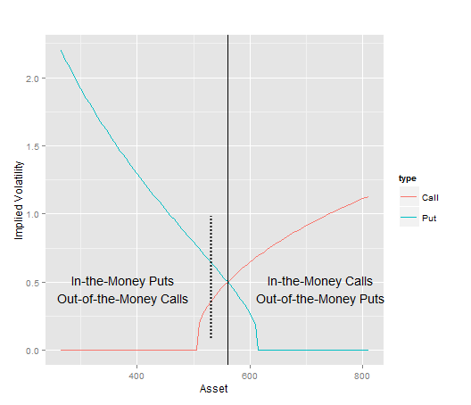
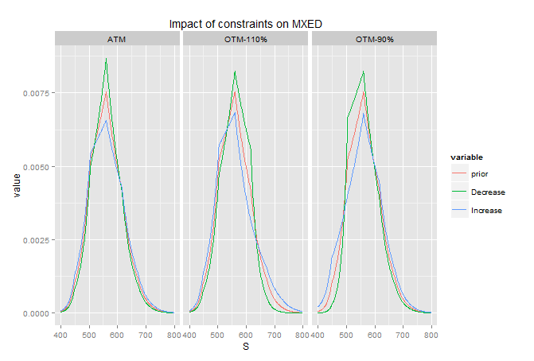

```{r, echo = FALSE, message=FALSE, warning=FALSE}
library(knitr)
```

## Numerical implementation steps

1. Option prices snap from Google Finance API
2. Data cleaning:
    - Calculate mid from bid / ask
    - Keep only relevant option prices (put-call parity/liquidity)
3. Apply the Cross Entropy Minimization algorithm
4. Compute option prices from asset distribution
5. Convert option prices into Black-Scholes Implied Volatility

--- .class #id 
## GOOG.OQ Option quotes
 


--- .class #id 
## Put-Call parity
$d_{1}=\frac{1}{\sigma\sqrt{T-t}}\left[ln\left(\frac{S}{K}\right)+(r-\frac{\sigma^{2}}{2})(T-t)\right]$

$d_{2}=\frac{1}{\sigma\sqrt{T-t}}\left[ln\left(\frac{S}{K}\right)+(r-\frac{\sigma^{2}}{2})(T-t)\right]$

Call option: $C(S,t)=N(d_{1})S-N(d_{2})Ke^{-r(T-t)}$

Put Option: $P(S,t)=-N(-d_{1})S+N(-d_{2})Ke^{-r(T-t)}$

Put-Call parity: $C(t)+Ke^{-r(T-t)}=P(t)+S(t)$


--- .class #id 
## Volatility smile



--- .class #id 
## Cross Entropy Minimization algorithm

Minimize $S(p,q)=\int_{-\infty}^{\infty}p(x)\log\left[\frac{p(x)}{q(x)}\right]dx$
    
Subject to: 
- $\int_{0}^{\infty}p(x)dx=1$
- $\forall i=1,2,..m\;\mathbb{E}\left[c_{i}(X)\right]=\int_{0}^{\infty}p(x)\; c_{i}(x)dx=ci$

1. A uniform distribution is used as a prior (non-informed prior)
2. Integrability constraint
2. Option prices used as constraints should be linearly independant
3. Forward is also used as a constraint (mean)
4. Choice of asset step for the discretisation / boundaries
5. Lagrangian function is minimized using an optimization routine (Limited-memory Broyden-Fletcher-Goldfarb-Shanno)


--- .class #id 
## GOOG.OQ Asset distribution


Pdf1: Asset distribution inferred from 9 option prices

Pdf2: Asset distribution inferred from 1 option price

--- .class #id 
## Asset distribution with constant volatility (25%)


Asset distribution inferred from 6 option prices (constant volatility)

--- .class #id 
## GOOG.OQ Volatility smile

$c(K)=D(T)\int_{0}^{\infty}p(x)\;\left(x-K\right)^{+}dx$ 

$p(K)=D(T)\int_{0}^{\infty}p(x)\;\left(K-x\right)^{+}dx$


--- .class #id 
## Conclusion

1. We have observed that assets distribution inferred from options prices are not log-normal (i.e. Volatility is not constant)  
2. Principle of Minimum Cross-Entropy can be used to estimate the distribution of an asset without assuming a particular distribution shape or family of distribution (non-parametric approach)
3. The algorithm is stable and fast
4. This method can be used to perform implied volatility interpolation/extrapolation from only few quotes

--- .class #id 
## Thank You

--- .class #id 
## References
+ [BuchenKelly96] The Maximum Entropy Distribution of an Asset Inferred from Option Prices (Peter W. Buchen, Michael Kelly)

--- .class #id 
## Appendix

--- .class #id 
## Kullback-Leibler Relative entropy
1. In Information Theory, Shannon defines the entropy as a measure of unpredictability of information content
2. the KL relative entropy (or KL divergence) is a non-suymetric mesure of the difference between two probability distribution P and Q. 
3. $D_{KL}(P\Vert Q)=\int_{-\infty}^{\infty}p(x)\ln\frac{p(x)}{q(x)}dx$
4. Properties:
- KL is equal to zero if P and Q are identical
- KL relative entropy is always positive

--- .class #id 
## Calculation of Relative Entropy

```{r, echo = FALSE, message=FALSE, fig.width=9, fig.height = 6, fig.align='center'}
library(ggplot2)
RelativeEntropy = function (P,Q) {
  xentropy = -1
  if (length(P) == length(Q)) {
    xentropy = 0
    for (i in seq(1,length(P)))
      xentropy = xentropy + P[i] * log(P[i]/Q[i])
  }
  else {
    warning("P and Q do not have same number of elements")
  }
  return(xentropy)
}


X = seq(-5,5,by=0.001)
P1 = sapply(X,function (x) dnorm(x, mean=0,sd=sqrt(0.9)))
P2 = sapply(X,function (x) dnorm(x, mean=0,sd=sqrt(1.5)))
P3 = sapply(X,function (x) dt(x,df=1))
P4 = sapply(X,function (x) dunif(x,min=-5,5))
Q = sapply(X,function (x) dnorm(x, mean=0,sd=1))


data.df = data.frame(
  x = rep(X,4),
  q = rep(Q,4),
  p = c(P1,P2,P3,P4),
  dist = factor(rep(c("P1","P2","P3","P4"),rep(length(Q),4)))
)

distribution_names <- list(
  'P1'="Norm(meam=0,var=0.9)",
  'P2'="Norm(mean=0,var=1.5)",
  'P3'="T(df=1)",
  'P4'="Unif(min=-5,max=-5)"
)

distribution_labeller <- function(variable,value){
  return(distribution_names[value])
}

annotation.df = data.frame(
  x = rep(0,4),
  q = rep(0,4),
  p = rep(0,4),
  dist = factor(c("P1","P2","P3","P4")),
  lab = round(unlist(lapply(list(P1,P2,P3,P4),RelativeEntropy, Q = Q)),2)
)

# plot distro
g = ggplot(data.df, aes(x = x, group = dist))
g = g + geom_line(aes(y = p, colour="Posterior"))
g = g + geom_line(aes(y = q, colour="Prior"))
g = g + facet_grid(.~dist,labeller=distribution_labeller) 
g = g + geom_text(data = annotation.df, aes(y = p, label =lab) ) 
g = g + scale_colour_manual("", values = c("Posterior"="red", "Prior"="blue"))
g = g + theme(
  panel.grid.major = element_blank(), 
  panel.grid.minor = element_blank(),               
  panel.background = element_blank(), 
  axis.line = element_line(colour = "black"))
plot(g)
```

--- .class #id 
## Formulating the Optimization problem

We have one prior probability density function $q(x)$

We have $m$ price constraints: $\forall i=1,2,..m\; d_{i}=D(T)\mathbb{E}_{\mathbb{Q}}\left[c_{i}(X_{T})\right]$
where
- $D(T)=e^{-(r-q)T}$ represents the discount factor
- $c_{i}(X_{t})$ denotes the $i$th option pay-off function at expiry
depenent only on the asset value at expiry
- $d_{i}$is the corresponding option price
- $r$ risk-free rate for $T$
- $q$ dividend yield

--- .class #id 
## Formulating the Optimization problem (2)

Minimize $S(p,q)=\int_{-\infty}^{\infty}p(x)\log\left[\frac{p(x)}{q(x)}\right]dx$

Subject to 2 constraints:

1. $\int_{0}^{\infty}p(x)dx=1$
2. $\forall i=1,2,..m\;\mathbb{E}\left[c_{i}(X)\right]=\int_{0}^{\infty}p(x)\; c_{i}(x)dx=ci$

This is a standard constrained optimization problem which solved by using the method of Lagrange which transforms a problem in n variable and m constraints into an unconstrainted optimization with n+m variables.

--- .class #id 
## Objective function

$H(p)=-\int_{0}^{\infty}p(x)\log\left[\frac{p(x)}{q(x)}\right]dx+(1+\lambda_{0})\int_{0}^{\infty}p(x)dx+\sum_{i=1}^{m}\lambda_{i}\int_{0}^{\infty}p(x)\; c_{i}(x)dx$

From standard calculus, we know that the minimum $\lambda^{*}=(\lambda_{0}^{*},\ldots,\lambda_{M}^{*})$
is reached when:
- the gradient (vector of derivatives)$\delta H$ is equal to zero:
    $\delta H(\lambda^{*})=\int_{0}^{\infty}\left[-\log\left[\frac{p(x)}{q(x)}\right]+\lambda_{0}+\sum_{i=1}^{m}\lambda_{i}c_{i}(x)\right]\delta p(x)dx=0$
    (necessary condition)
- the hessian (matrix of second derivatives) is positive definite 
    (sufficient condition)

--- .class #id 
## Objective function solution

This leads immediately to the following explicit representation of
the MED:

$p(x)=\frac{q(x)}{\mu}\exp\left(\sum_{i=1}^{m}\lambda_{i}c_{i}(x)\right)$,
$\mu=\int_{0}^{\infty}q(x)\exp\left(\sum_{i=1}^{m}\lambda_{i}c_{i}(x)\right)dx$

--- .class #id 
## Impact of constraints on MXED



--- .class #id 
## Thank You

--- .class #id 

