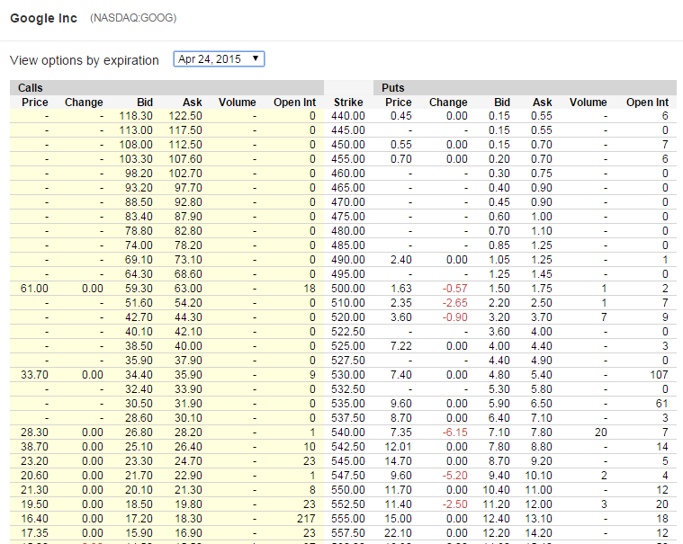

## Problem statement

1. Illiquid Equity option markets
2. Only 2/3 quotes per week
3. Banks must mark to market their books every day
4. Based on what volatility surface?

--- .class #id 

## Objective

1. Use prior information and constraints to find posterior
2. requires no interpolation / extroplation 
3. density with 

--- .class #id

## Kullback-Leibler Relative entropy

1. In Information Theory, Shannon defines the entropy as a measure of unpredictability of information content
2. the KL relative entropy (or KL divergence) is a non-suymetric mesure of the difference between two probability distribution P and Q. 
3. $D_{KL}(P\Vert Q)=\int_{-\infty}^{\infty}p(x)\ln\frac{p(x)}{q(x)}dx$
4. Properties:
- KL is equal to zero if P and Q are identical
- KL relative entropy is always positive

--- .class #id 

## Principle of Minimum Cross Entropy (PMXE)

1. In Bayesian statistics the KL divergence can be used as a measure of the information gain in moving from a prior distribution to a posterior distribution. If some new fact Y = y is discovered, it can be used to update the probability distribution for X from p(x | I) to a new posterior probability distribution p(x | y,I) using Bayes' theorem:
2. Relative Entropy for various P

--- .class #id 

## Examples of PMXE

--- .class #id 

## Formulating the Optimization problem

We have one prior probability density function $q(x)$

We have $m$ price constraints: $\forall i=1,2,..m\; d_{i}=D(T)\mathbb{E}_{\mathbb{Q}}\left[c_{i}(X_{T})\right]$
where
- $D(T)=e^{-(r-q)T}$ represents the discount factor
- $c_{i}(X_{t})$ denotes the $i$th option pay-off function at expiry
depenent only on the asset value at expiry
- $d_{i}$is the corresponding option price
- $r$ risk-free rate for $T$
- $q$ dividend yield

--- .class #id 

## Formulating the Optimization problem (2)

Minimize $S(p,q)=\int_{-\infty}^{\infty}p(x)\log\left[\frac{p(x)}{q(x)}\right]dx$

Subject to 2 constraints:

1. $\int_{0}^{\infty}p(x)dx=1$
2. $\forall i=1,2,..m\;\mathbb{E}\left[c_{i}(X)\right]=\int_{0}^{\infty}p(x)\; c_{i}(x)dx=ci$

This is a standard constrained optimization problem which solved by using the method of Lagrange which transforms a problem in n variable and m constraints into an unconstrainted optimization with n+m variables.

--- .class #id 

## Objective function

la lal al la 

$H(p)=-\int_{0}^{\infty}p(x)\log\left[\frac{p(x)}{q(x)}\right]dx+(1+\lambda_{0})\int_{0}^{\infty}p(x)dx+\sum_{i=1}^{m}\lambda_{i}\int_{0}^{\infty}p(x)\; c_{i}(x)dx$

From standard calculus, we know that the minimum $\lambda^{*}=(\lambda_{0}^{*},\ldots,\lambda_{M}^{*})$
is reached when:
- the gradient (vector of derivatives)$\delta H$ is equal to zero:
$\delta H(\lambda^{*})=\int_{0}^{\infty}\left[-\log\left[\frac{p(x)}{q(x)}\right]+\lambda_{0}+\sum_{i=1}^{m}\lambda_{i}c_{i}(x)\right]\delta p(x)dx=0$
(necessary condition)
- the hessian (matrix of second derivatives) is positive definite (sufficient
condition)

--- .class #id 

## Objective function solution

This leads immediately to the following explicit representation of
the MED:

$p(x)=\frac{q(x)}{\mu}\exp\left(\sum_{i=1}^{m}\lambda_{i}c_{i}(x)\right)$,
$\mu=\int_{0}^{\infty}q(x)\exp\left(\sum_{i=1}^{m}\lambda_{i}c_{i}(x)\right)dx$

--- .class #id 

--- .class #id 

## Numerical implementation

Here are the steps:

1. Market data snapping (Google Finance JSON API)
2. Data cleaning (expiry date to time, mid calculation)
3. Only take price for call with strike > spot and put with strike < spot (put call parity)
4. Convert price to implied volatility to plot volatility smile

--- .class #id 
## Option quotes

--- .class #id 
## Volatility smile

--- .class #id 
## Asset distribution for multiple expiry dates

--- .class #id 
## Constant volatility

| strikePct| strikeAbs| price| impvol|
|---------:|---------:|-----:|------:|
|       0.6|       336|  0.00|   0.25|
|       0.7|       392|  0.00|   0.25|
|       0.8|       448|  0.25|   0.25|
|       0.9|       504|  4.11|   0.25|
|       1.0|       560| 23.24|   0.25|
|       1.1|       616|  5.82|   0.25|
|       1.2|       672|  0.96|   0.25|
|       1.3|       728|  0.11|   0.25|
|       1.4|       784|  0.01|   0.25|

--- .class #id 

## Maximum Entropy Distribution

--- .class #id 

## Volatility smile

--- .class #id 

## Conclusion

--- .class #id 

## Read-And-Delete

1. Edit YAML front matter
2. Write using R Markdown
3. Use an empty line followed by three dashes to separate slides!

--- .class #id 

